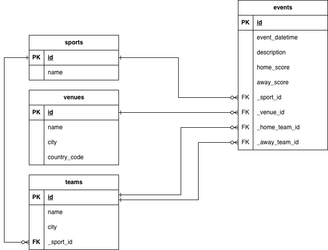

# Sportradar Coding Exercise

This project is a sports event calendar API built with Go, Gin, PostgreSQL, and Docker. It includes a full backend with CRUD operations for events, sports, teams, and venues, as well as a simple frontend with a public calendar and a private admin panel.
---

## 🚀 How to Run

1.  **Prerequisites:**
    * Docker
    * Docker Compose

2.  **Clone the repository:**
    ```bash
    git clone git@github.com:vsennikov/sportradar-be-exercise.git
    cd sportradar-be-exercise
    ```

3.  **Create the environment file:**
    Copy the example file. This contains all the necessary passwords and port configurations.
    ```bash
    cp .env.example .env
    ```

4.  **Build and run the application:**
    This command will build the Go application, start the PostgreSQL database, and run application.
    ```bash
    docker compose up --build
    ```

5.  **Access the application:**
    * **Event Calendar (Frontend):** `http://localhost:8080/`
    * **Admin Panel (Frontend):** `http://localhost:8080/static/admin.html`
    * **API (Backend):** `http://localhost:8080/api/v1`

---

## 🧪 How to Test with Postman

This project includes a Postman collection to make testing the API easy.

1.  Open Postman.
2.  Click the **Import** button (usually in the top-left).
3.  Find the `postman/` folder in this project.
4.  Drag and drop the `sportradar_api.postman_collection.json` file into the Postman window.
5.  (Optional) Import the `local.postman_environment.json` file in the same way. This sets up the `{{baseUrl}}` variable for you.

---

## 🧪 Running Tests

This project includes comprehensive unit and integration tests.

### Quick Start

```bash
# Run all tests (unit + integration)
go test ./...

# Run only unit tests (skip integration tests)
go test -short ./...

# Run tests with coverage
go test -cover ./...
```

### Test Documentation

For detailed information about the test suite, including:
- Test structure and organization
- How to set up the test environment
- Writing new tests
- Best practices
- Troubleshooting

See [TESTING.md](./TESTING.md) for complete testing documentation.

---

## API Endpoints

All endpoints are prefixed with `/api/v1`.

### Events

| Method | Endpoint | Description |
| :--- | :--- | :--- |
| `GET` | `/events` | Gets a paginated list of events. |
| `GET` | `/events/:id` | Gets a single event by its unique ID. |
| `POST` | `/events` | Creates a new event. (Returns new ID) |
| `PATCH` | `/events/:id` | Partially updates an existing event. |
| `DELETE`| `/events/:id` | Deletes an event. |

**Filtering & Pagination for `GET /events`:**

The `GET /events` endpoint supports the following query parameters:
* **`page`**: (Optional) The page number you want to view. *Example:* `?page=2`
* **`limit`**: (Optional) The number of events to show per page. *Example:* `?limit=5`
* **`sport_id`**: (Optional) Filters the list for a specific sport. *Example:* `?sport_id=1`
* **`date_from`**: (Optional) Filters for events on or after a date. *Example:* `?date_from=2025-01-01`

### Sports

| Method | Endpoint | Description |
| :--- | :--- | :--- |
| `GET` | `/sports` | Gets a list of all sports. |
| `GET` | `/sports/:id` | Gets a single sport by its unique ID. |
| `POST` | `/sports` | Creates a new sport. (Returns new ID) |
| `PUT` | `/sports/:id` | Replaces an existing sport. |
| `DELETE`| `/sports/:id` | Deletes a sport (Fails if in use). |

### Teams

| Method | Endpoint | Description |
| :--- | :--- | :--- |
| `GET` | `/teams` | Gets a list of all teams. |
| `GET` | `/teams/:id` | Gets a single team by its unique ID. |
| `POST` | `/teams` | Creates a new team. (Returns new ID) |
| `PATCH` | `/teams/:id` | Partially updates an existing team. |
| `DELETE`| `/teams/:id` | Deletes a team (Fails if in use). |

### Venues

| Method | Endpoint | Description |
| :--- | :--- | :--- |
| `GET` | `/venues` | Gets a list of all venues. |
| `GET` | `/venues/:id` | Gets a single venue by its unique ID. |
| `POST` | `/venues` | Creates a new venue. (Returns new ID) |
| `PATCH` | `/venues/:id` | Partially updates an existing venue. |
| `DELETE`| `/venues/:id` | Deletes a venue. |

---

## Database Design

Here is the Entity-Relationship Diagram (ERD) for the project:

